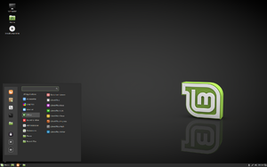
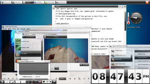
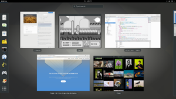
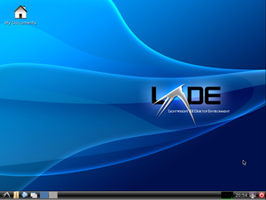
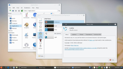
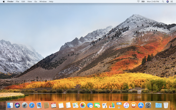
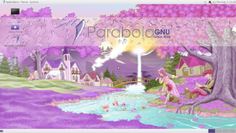
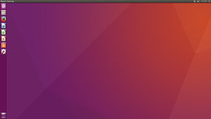
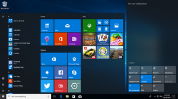
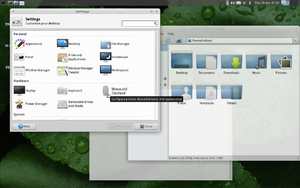

# Detect Desktop Environment

This crate helps you to detect the current desktop environment.
It was inspired by the [`detectDE`](https://cgit.freedesktop.org/xdg/xdg-utils/tree/scripts/xdg-utils-common.in?h=fa5805559ad27382ef62110cb23e67d6eb649030#n270)
function from _xdg-util_.

This library is stable. If you have an issue or want to add a desktop environment, open
a Github issue or send a PR.
Please also report possible naming issues.

## Installation


## Usage

```rust
extern crate detect_desktop_environment;

use detect_desktop_environment::{DesktopEnvironment, detect};

fn main() {
  let de: DesktopEnvironment = detect();
  println!("{:?}", de);
}

```

This library exposes two symbols: the `detect` function and it return value: the
`DesktopValue` enum. All the variants are listed below in the "Supported environments"
section.

## Supported environments

| Name            | Thumbnail                                        |
|-----------------|--------------------------------------------------|
| `Cinnamon`      |            |
| `Enlightenment` |  |
| `Gnome`         |                  |
| `Kde`           |                      |
| `Lxde`          |                    |
| `Lxqt`          |                    |
| `MacOs`         |                   |
| `Mate`          |                    |
| `Unity`         |                  |
| `Windows`       |                  |
| `Xfce`          |                    |
| `Unknown`       |                                                  |
