# Detect Desktop Environment

[](https://github.com/demurgos/detect-desktop-environment)
[](https://crates.io/crates/detect-desktop-environment)
[](https://github.com/demurgos/detect-desktop-environment/actions/workflows/check-rs.yml?query=branch%3Amain)
[](https://docs.rs/detect-desktop-environment)
[](./LICENSE.md)

This crate helps you to detect the current desktop environment.
It was inspired by the [`detectDE`](https://cgit.freedesktop.org/xdg/xdg-utils/tree/scripts/xdg-utils-common.in?h=fa5805559ad27382ef62110cb23e67d6eb649030#n270)
function from _xdg-util_.

## Installation

Run the following command in your project:
```
cargo add detect-desktop-environment
```

## Usage

```rust
use detect_desktop_environment::DesktopEnvironment;

fn main() {
    match DesktopEnvironment::detect() {
        Some(de) => println!("detected desktop environment: {de:?}"),
        None => println!("failed to detect desktop environment"),
    }
}
```

This library exposes two symbols: the `detect` function and it returns value: the
`DesktopValue` enum. All the variants are listed below in the "Supported environments"
section.

## Supported environments

| Name            | Thumbnail                                        |
|-----------------|--------------------------------------------------|
| `Cinnamon`      |            |
| `Cosmic`        | 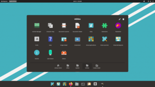               |
| `Dde`           | 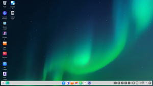               |
| `Ede`           | 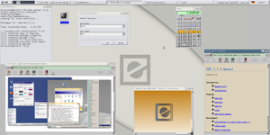                     |
| `Endless`       | 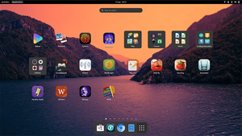             |
| `Enlightenment` |  |
| `Gnome`         |                  |
| `Hyprland`      | 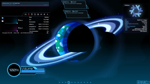           |
| `Kde`           |                      |
| `Lxde`          |                    |
| `Lxqt`          |                    |
| `MacOs`         |                 |
| `Mate`          |                    |
| `Old`           | 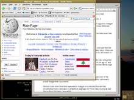                     |
| `Pantheon`      | 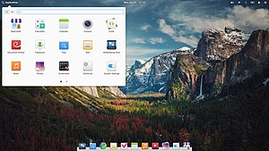           |
| `Razor`         | 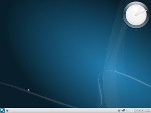                 |
| `Rox`           | 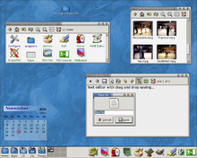                     |
| `Sway`          | 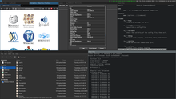                   |
| `Tde`           | 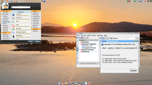                     |
| `Unity`         |                  |
| `Windows`       |              |
| `Xfce`          |                    |

# Documentation

See [docs.rs/detect-desktop-environment](https://docs.rs/detect-desktop-environment).

# Maintenance status

This library is stable and no major changes are expected.

If you want to improve the library, feel free to open an issue or send a PR. Breaking changes are allowed.
Note however that review times may be slow.

# Minimum Supported Rust Version (MSRV) policy

The last 8 stable versions are explicitly supported (1 year). See [Cargo.toml](./Cargo.toml) for details.

# License

[MIT](./LICENSE.md)
